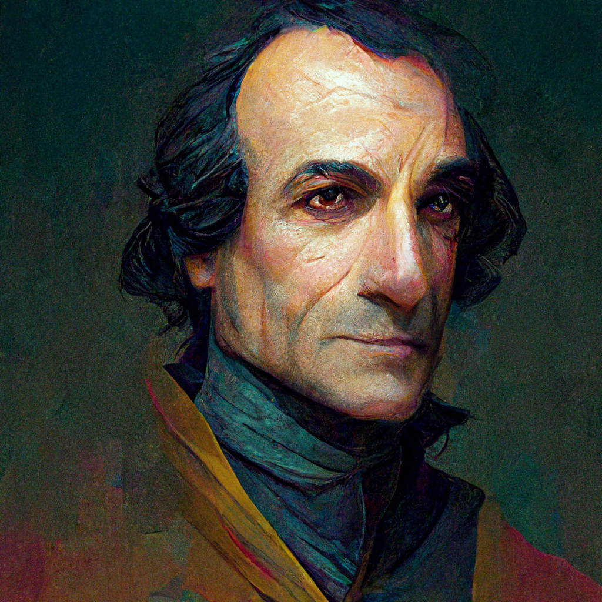
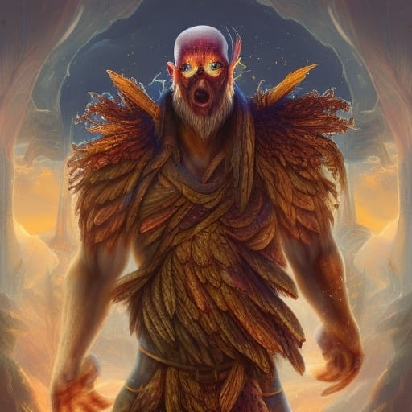
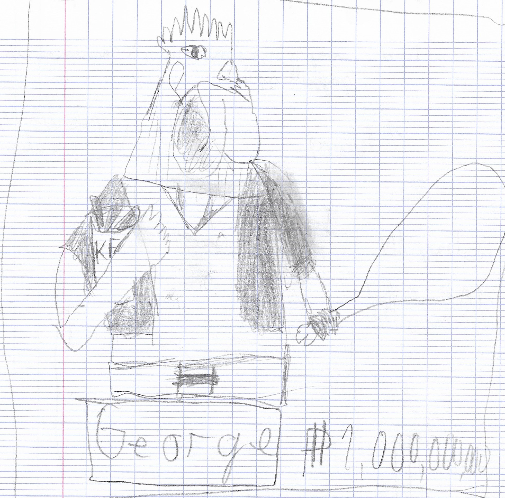

# George 
*La colère du dieu poulet*

Dans un monde où chaquun des animaux ont des divinités qui leur sont associées,
un festival est organsié chaque année pour rendre honeur à ces dieux qui permettent aux humains de survivre grâce aux bienfaits de toutes ces créatures,
[]
Mais dans le petit village de Durnatel où l'inquisiteur a été élu récement, les chosent ne vont pas se passer normalement, mené par sa haine envers les galinacés, l'inquisiteur une fois au pouvoir décida de bannir les poulets du festival des animaux.
[]
Ceci attira l'attention du dieu poulet en personne qui a alors décidé de chatier ces hérétiques, il envoie son plus fidèle serviteur George, un demi-dieu invincible à la force démesuré réduire ce village en cendres.
[]
Vous incarnerez le dieu poulet et commanderez George dans ce bain de sang à sens unique, arriverez vous à vous occuper de ses hérétique avant question pour un dieu présenté par le dieu pigeon? ou alors pour l'heure du thé? tant de chose à faire en tant que dieu alors autant faire vite.
